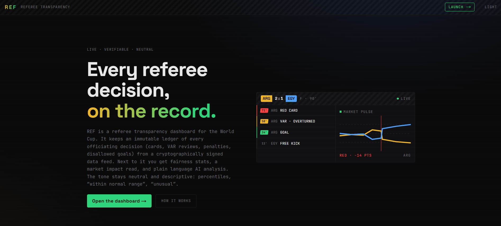
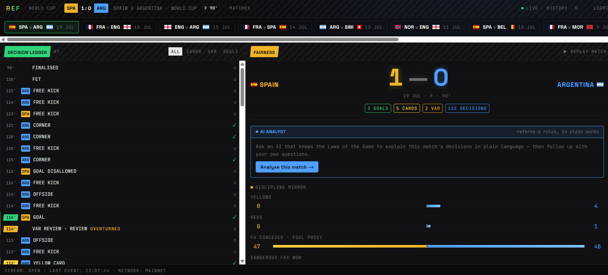
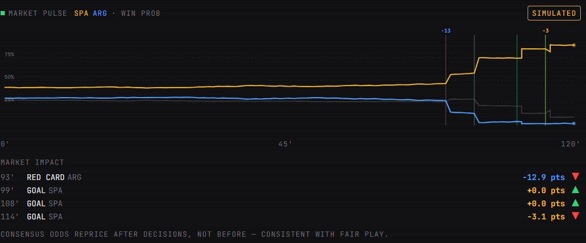

# REF: Referee Transparency for the World Cup

**Live app:** https://ref-sage.vercel.app/
**Demo video:** https://loom.com/share/folder/3121db8ec55d4b3b83775642212cf235

Built for the **TxODDS World Cup Hackathon** 

---

## Every controversial decision follows the same pattern

Every World Cup produces moments that divide millions of fans.

A goal is ruled out for a marginal offside. A penalty is awarded after a long VAR review. A red card changes the course of a knockout match. Within minutes social media fills with screenshots, slow-motion clips, and claims that the referee got it wrong—or worse, that the match was influenced.

The problem is that almost nobody has access to the complete picture.

Fans see isolated clips. Commentators focus on the biggest moments. Statistics are scattered across different sources. By the time emotions settle, opinions have already hardened into narratives.

That is the problem REF was built to solve.

## The solution

**REF is a referee transparency dashboard.** It takes the raw, cryptographically
signed match feed and turns it into something a casual fan and a seasoned analyst
can both read: an immutable, timestamped record of every officiating decision, with
plain-language context for how unusual (or how normal) the match actually was.

Instead of arguing over vibes, you can check the record:

- Was the card count actually lopsided, or does it just feel that way?
- How does this match's VAR activity compare to every other World Cup game?
- Did the betting market react **after** the red card, or did it move suspiciously
  **before** it?

REF never says "bias" and never says "rigged." It says **within normal range**,
**unusual**, or **rare**, and it shows you the numbers behind the word. The goal is
not to accuse referees or to defend them. It is to replace conspiracy with evidence.

## Core features

| Feature | What it does |
| --- | --- |
| **Decision Ledger** | A real-time, newest-first log of every call: goals, cards, penalties, VAR reviews and disallowed goals. Each row carries a minute stamp, the team involved, a plain explanation, and a verification mark linking to its on-chain proof. |
| **Fairness View** | Both teams' discipline mirrored side by side (cards, foul proxy, corners, VAR checks) and placed against historical World Cup benchmarks. Percentile chips read *within normal range*, *unusual* or *rare* in language anyone can follow. |
| **Market Pulse** | Consensus win-probability plotted over match time, with zero betting. It uses the odds market purely as a neutral, independent observer to measure what each decision cost and whether the crowd saw it coming. |
| **AI Analyst** | An assistant grounded in the IFAB Laws of the Game that breaks the match down in plain words and answers your follow-up questions in a live chat. |
| **Replay Mode** | Any completed match plays back as a ~42-second highlight reel: rolling score, growing discipline bars, a moving timeline playhead, and broadcast-style banners for the big moments. |

## Why the betting market matters (the anti-conspiracy angle)

The single most compelling signal REF offers is timing. A market that reprices a
match **after** a red card becomes public, rather than before it, is evidence the
decision was not leaked or predicted in advance. When every major decision's
pre-window is flat relative to its post-move, that is consistent with fair play.

REF reads consensus odds strictly as an integrity instrument. The app has **zero
betting functionality**: it never places, brokers, or displays wagers. Odds are one
more neutral measurement, nothing else.

## Tech stack

- **Data feed:** [TxODDS](https://txodds.com) **TxLINE** cryptographically signed
  score and odds streams. Live scores over SSE, historical match records, consensus
  StablePrice odds, and per-player stat snapshots for scorers and bookings.
- **On-chain verification:** each decision is validated against TxLINE's
  **Solana**-anchored stat proofs (`/scores/stat-validation`). Anchored decisions
  link straight to the program on Solana Explorer. Unavailable proofs degrade to
  "pending", never to a false checkmark.
- **App:** **Next.js** (App Router) with server-side streaming routes, a React
  dashboard, and Framer Motion for the live and replay motion.
- **AI Analyst:** an LLM grounded only in the selected match's normalized data,
  using the same neutral vocabulary as the rest of the app.

All external credentials stay server-side. The browser never sees an API token; it
only ever receives normalized events.

## Screenshots

> Replace the placeholder images below with real captures before submission.

**Home / Landing Page**



**Main Match Dashboard**



**Decision Ledger & Fairness Panel**


**Market Pulse Chart**



## Run it locally

Requires **Node.js 20+** and npm.

```bash
npm install
npm run dev        # http://localhost:3000  (landing)  ·  /app  (dashboard)
```

The dashboard opens on the most recently played World Cup match with its full
record. Press **`m`** to browse every fixture by flag, and hit **▶ Replay Match**
in the fairness header to watch it unfold.

### Production build

```bash
npm run build
npm run start      # serves on http://localhost:3000
```

### Environment variables (`.env.local`)

Required for live data and on-chain verification. All values stay server-side.

| Variable | Example | Purpose |
| --- | --- | --- |
| `TXLINE_API_ORIGIN` | `https://txline.txodds.com` | TxLINE API host |
| `TXLINE_NETWORK` | `mainnet` or `devnet` | drives Solana explorer links and the footer label |
| `TXLINE_API_TOKEN` | `…` | your activated TxLINE API token |
| `TXLINE_FIXTURE_ID` | `17952170` | optional default fixture for LIVE mode |
| `OPENAI_API_KEY` | `sk-…` | enables the AI Analyst (optional; the app runs without it) |

A TxLINE token is activated by an on-chain Solana subscription. See
`scripts/activate-mainnet.mts` for the one-shot activation flow. Without a token the
app still runs and reports honest stream status in the footer.

## Repo layout

```
src/app/            Next.js routes (landing, /app dashboard, /api streaming + data)
src/components/     Dashboard, Ledger, Fairness, Market Pulse, AI Analyst, Landing
src/lib/txline/     TxLINE API client, feed normalization and event mapping
src/lib/sources/    live / history / replay match sources
src/lib/            reducers, verification, odds, baselines, dedup keys
```
